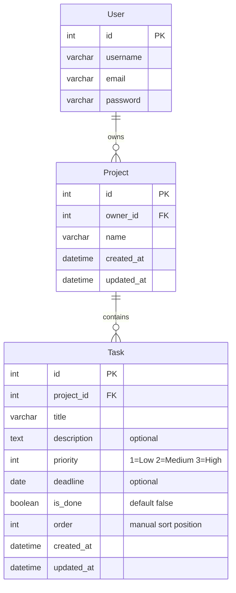

# Database Schema

## Entity Relationship Diagram

## Tables

### `projects_project`

| Column | Type | Constraints | Description |
|--------|------|-------------|-------------|
| `id` | integer | PRIMARY KEY | Auto-generated identifier |
| `owner_id` | integer | FK → `auth_user(id)` CASCADE | The user who owns this project |
| `name` | varchar(255) | NOT NULL | Title of the TODO list |
| `created_at` | timestamp | NOT NULL | Set on creation |
| `updated_at` | timestamp | NOT NULL | Updated on every save |

### `tasks_task`

| Column | Type | Constraints | Description |
|--------|------|-------------|-------------|
| `id` | integer | PRIMARY KEY | Auto-generated identifier |
| `project_id` | integer | FK → `projects_project(id)` CASCADE | Owning project |
| `title` | varchar(255) | NOT NULL | Short task description |
| `description` | text | | Detailed notes |
| `priority` | integer | NOT NULL, default 2 | 1 = Low, 2 = Medium, 3 = High |
| `deadline` | date | nullable | Optional due date |
| `is_done` | boolean | NOT NULL, default false | Completion status |
| `order` | integer | NOT NULL, default 0, indexed | Display order within the project |
| `created_at` | timestamp | NOT NULL | Set on creation |
| `updated_at` | timestamp | NOT NULL | Updated on every save |

## Indexes

| Index | Column(s) | Purpose |
|-------|-----------|---------|
| Primary key | `id` | All tables |
| `tasks_task_project_id` | `project_id` | Fast lookup of all tasks in a project |
| `tasks_task_order` | `order` | Optimise task sort queries |
| `projects_project_owner_id` | `owner_id` | Fast lookup of all projects for a user |

## Cascade Rules

- Deleting a **User** cascades to all their **Projects**.
- Deleting a **Project** cascades to all its **Tasks**.
